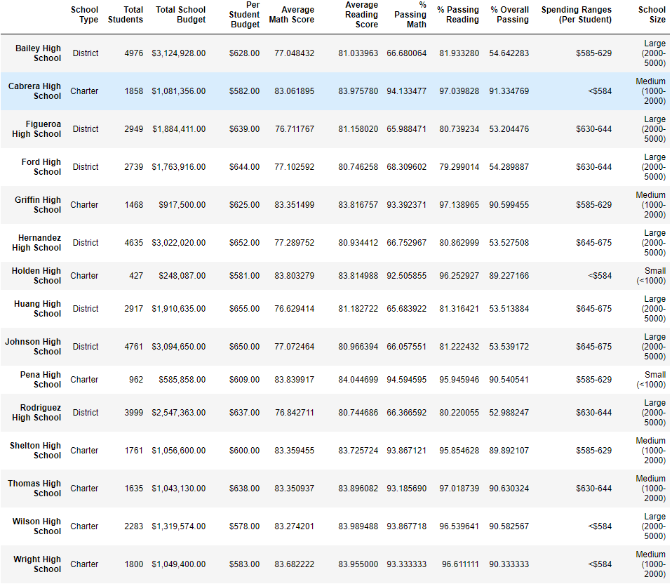

# School_District_Analysis
## Overview of the school district analysis
The school board has notified Maria and her supervisor that the data shows evidence of academic dishonesty, particularly, the reading and math grades for Thomas High School ninth graders. In order to uphold state-testing standards, Maria has asked me to replace the math and reading scores for Thomas High School with null values while keeping the rest of the data as it is. I have conducted the school district analysis once again and this report will provide a description of how these changes affected the overall analysis. 
## Results
### How is the district summary affected?
* There were 39,170 total students in the district
* There was a slight decrease in the average math score of about 0.1%
* The average reading score rounded to the nearest tenth did not change, but there was an actual slight decrease of around 0.02% 
* There was a decrease in the % Passing Math of about 1.1%
* There was a decrease in the % Passing Reading of about 1.1%
* There was a decrease in the % Overall Passing of about 1%

#### District Summary Results After Removing Thomas High School Ninth Graders: 

#### District Summary Results Before Removing Thomas High School Ninth Graders: 

### How is the school summary affected?
* Except for the Thomas High School average scores and passing percentages, nothing else was affected in the school summary
* Thomas High School's average math score decreased by around 0.067 points
* Thomas High School's average reading score increased by around 0.047 points
* Thomas High School's % passing math decreased by around 0.086%
* Thomas High School's % passing reading decreased by around 0.29%
* Thomas High School's % overall passing decreased by around 0.32%
* In summary, the average math score, % passing math and reading and % overall passing decreased while the average reading score increased

#### School Summary Results After Removing Thomas High School Ninth Graders: 

#### School Summary Results Before Removing Thomas High School Ninth Graders: 

### How does replacing the ninth graders’ math and reading scores affect Thomas High School’s performance relative to the other schools?
* Thomas High School's overall performance went down since the % overall passing decreased by around 0.32% while the other schools' performance stayed the same
* Despite Thomas High School's decreased in both % passing of math and reading and the % overall passing, Thomas High School still remained among the top 2 schools in the district
* Thomas High School's average math score and % passing math both decreased
* Thomas High School's average reading score went down while the % passing reading went up which indicates that there used to be a higher concentration in ninth graders that did not pass reading which helped drive the % passing after being excluded from the calculation

#### Top 5 School Summary Results After Removing Thomas High School Ninth Graders: 

#### Top 5 School Summary Results Before Removing Thomas High School Ninth Graders: 

### How does replacing the ninth-grade scores affect the following:
* Math and reading scores by grade

    * There was no change in the math and reading scores by grade except for Thomas High School ninth grade scores not being counted

    #### Math Scores by Grade Results After Removing Thomas High School Ninth Graders: 
    

    #### Math Scores by Grade Results Before Removing Thomas High School Ninth Graders: 
    

    #### Reading Scores by Grade Results After Removing Thomas High School Ninth Graders: 
    

    #### Reading Scores by Grade Results Before Removing Thomas High School Ninth Graders: 
    

* Scores by school spending
    
    * The only spending range bucket that changed was the bucket of $630-644 since Thomas High School belongs to this bucket
    * In the $630-644 bucket, the average math and reading score stayed about the same while the % passing math, reading and overall passing decreased
    * In the $630-644 bucket, the % passing math decreased by about 10%
    * In the $630-644 bucket, the % passing reading decreased by about 10%
    * In the $630-644 bucket, the % overall passing decreased by about 9%

    #### Scores by School Spending Results After Removing Thomas High School Ninth Graders: 
    

    #### Scores by School Spending Results Before Removing Thomas High School Ninth Graders: 
    

* Scores by school size
    
    * The only school size range that changed was the medium size since Thomas High School belongs to this category
    * In the medium size category, the average math and reading score stayed about the same while the % passing math, reading and overall passing decreased
    * In the medium size category, the % passing math decreased by about 7%
    * In the medium size category, the % passing reading decreased by about 7%
    * In the medium size category, the % overall passing decreased by about 7%

    #### Scores by School Size Results After Removing Thomas High School Ninth Graders: 
    

    #### Scores by School Size Results Before Removing Thomas High School Ninth Graders: 
    

* Scores by school type

    * The only school type that changed was the medium size since Thomas High School belongs to this category
    * In the charter school category, the average math and reading score stayed about the same while the % passing math, reading and overall passing decreased
    * In the charter school category, the % passing math decreased by about 4%
    * In the charter school category, the % passing reading decreased by about 4%
    * In the charter school category, the % overall passing decreased by about 5%

    #### Scores by School Type Results After Removing Thomas High School Ninth Graders: 
    

    #### Scores by School Type Results Before Removing Thomas High School Ninth Graders: 
    

## Summary

The first major change that I noticed was that Thomas High School's average reading score went down while the % passing reading went up. This might have been due to a higher concentration in ninth graders that did not pass the minimum of 70 to pass. As for the ninth graders that have passed reading, they were more likely below the average reading score but above the minimum 70. As a result of this, the removal of Thomas High School ninth graders' reading scores led to an actual increase in the % passing of reading in Thomas High School.

The second major change is the % overall passing for Thomas High School. After their math and reading scores were removed, the % overall passing decreased by ~0.32%. In terms of top 5 schools in the district, Thomas High School places second with a 0.7% difference from the top school, Cabrera High School, and a 0.03% difference from the school placing third, Griffin High School. The 0.32% decrease had a huge impact since it could have potentially decreased Thomas High School's ranking to third place instead of second place. 

The third major change was the impact to the overall district performance. According to the analysis made above, the average math score, % passing math and reading, and % overall performance decreased, causing the entire performance of the district to decrease since Thomas High School's ninth graders' performance was inflated.  

The fourth major change was that the performance of the categories where Thomas High School belongs decreased overall. The overall performance of spending range of $630-644, medium school size and charter school types decreased due to Thomas High School's removal of ninth graders' scores which might impact future funding for schools belonging to these categories.